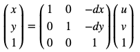
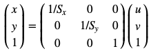
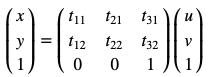

# Geometric Transformations

[English](README.en.md) | [日本語](README.md)

---------------------------------------

- [Translation](#translation)
- [Rotation](#rotation)
- [Scaling](#scaling)
- [Shearing](#shearing)
- [Affine Transformation](#affine) 

## Functions

### Translation<a id='translation'></a>

Considering that ``(u,v)`` is the new image pixel and ``(x,y)`` the old image pixel, translation is



```python
def translate(img,dx,dy):
    row,col = img.shape[:2]

    # resulting image
    img_f = np.zeros(img.shape)

    # translate
    for u in range(col):
        for v in range(row):
            x = u - dx
            y = v - dy
            if(0<=x<col and 0<=y<row):
                img_f[v,u] = img[y,x]

    return img_f
```


### Rotation (in degrees)<a id='rotation'></a>

Considering that ``(u,v)`` is the new image pixel and ``(x,y)`` the old image pixel, the image rotates around the pixel ``(0,0)``


```python
def rotate(img,ang):
    row,col = img.shape[:2]
    rad = ang*math.pi/180

    # resulting image
    img_f = np.zeros(img.shape)

    # rotate
    for u in range(col):
        for v in range(row):
            x = round(u*math.cos(rad)-v*math.sin(rad))
            y = round(u*math.sin(rad)+v*math.cos(rad))
            if(0<=x<col and 0<=y<row):
                img_f[v,u] = img[y,x]    
    return img_f
```


### Scaling<a id='scaling'></a>

Considering that ``(u,v)`` is the new image pixel and ``(x,y)`` the old image pixel, scaling is



```python
def scale(img,sx,sy):
    row,col = img.shape[:2]
    M,N = int(round(sy*row)), int(round(sx*col)) # new shape

    # resulting image
    if(img.ndim==3):
        img_f = np.zeros([M,N,3]) # for colored images
    else:
        img_f = np.zeros([M,N]) # for images in grayscale

    # scale
    for u in range(N):
        for v in range(M):
            x = round(u/sx)
            y = round(v/sy)
            if(0<=x<col and 0<=y<row):
                img_f[v,u] = img[y,x]

    return img_f
```


### Shearing<a id='shearing'></a>

Considering that ``(u,v)`` is the new image pixel and ``(x,y)`` the old image pixel, shearing is


```python
def shear(img,shx,shy):
    row,col = img.shape[:2]

    # resulting image
    img_f = np.zeros(img.shape)

    # shear
    for u in range(col):
        for v in range(row):
            x = round(u - v*shx)
            y = round(v - u*shy)
            if(0<=x<col and 0<=y<row):
                img_f[v,u] = img[y,x]

    return img_f
```


### Affine Transformation<a id='affine'></a>

Considering that ``(u,v)`` is the new image pixel and ``(x,y)`` the old image pixel, affine transformation is



```python
def affine(img,m):
    row,col = img.shape[:2]

    # resulting image
    img_f = np.zeros(img.shape)

    # affine transformation
    for u in range(col):
        for v in range(row):            
            x = int(round( t[0,0]*u + t[0,1]*v + t[0,2] ))
            y = int(round( t[1,0]*u + t[1,1]*v + t[1,2] ))
            if(0<=x<col and 0<=y<row):
                img_f[v,u] = img[y,x]

    return img_f
```


