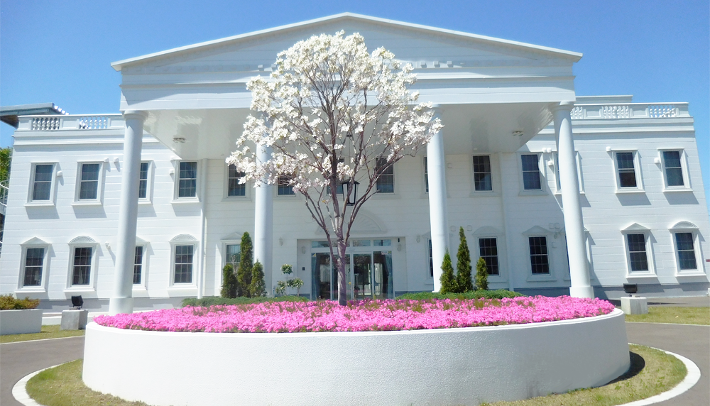
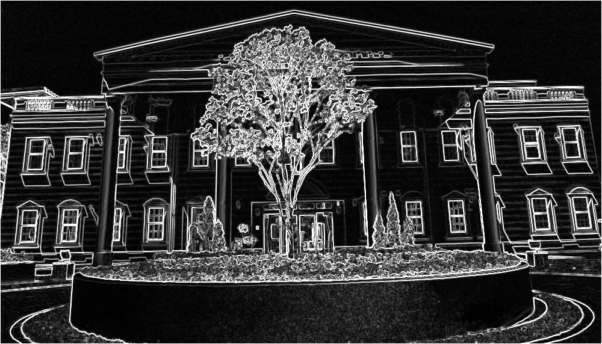
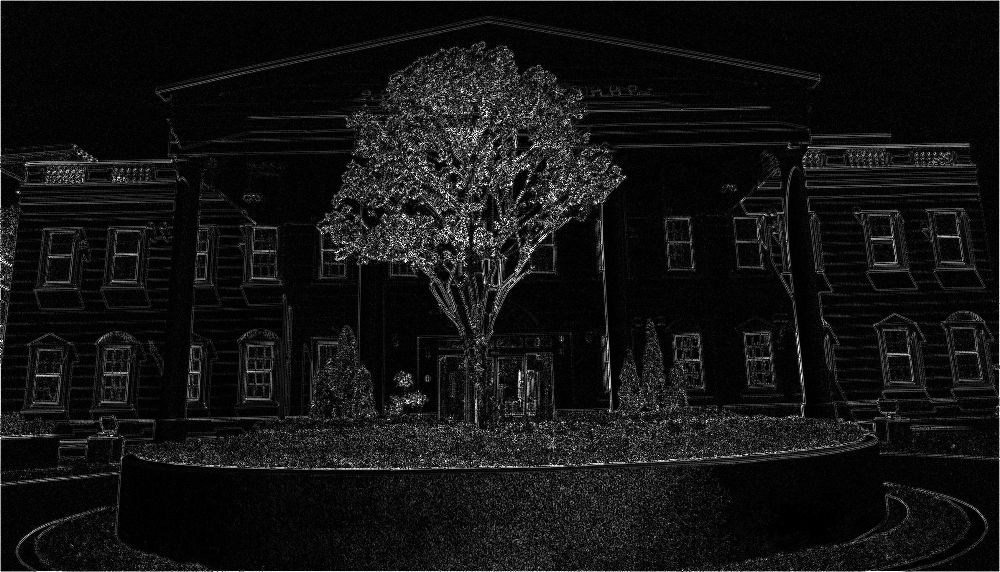
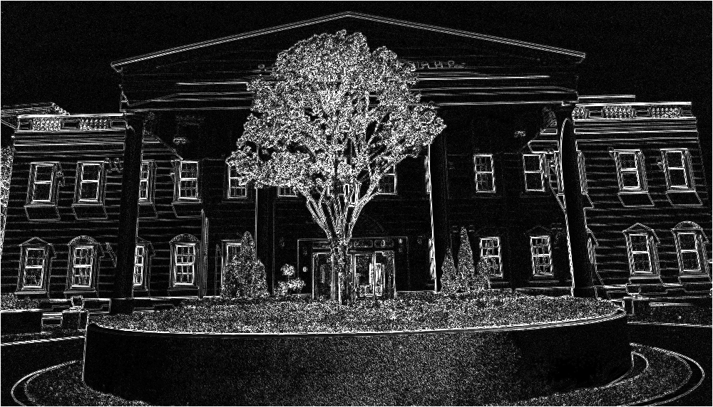

## Edge Detection

[English](README.en.md) | [日本語](README.md)

---------------------------------------

Simple image edge detection

`.py` and `.ipynb` version

### Libraries
- Numpy
- OpenCV
- Time

## Filters
- Difference
- Prewitt
- Roberts
- Sobel
- Laplacian 4
- Laplacian 8

Execution time of each filter: around 10 seconds

## Test

Input

Output

  

    
    
    
  

  

    
     
    
  

