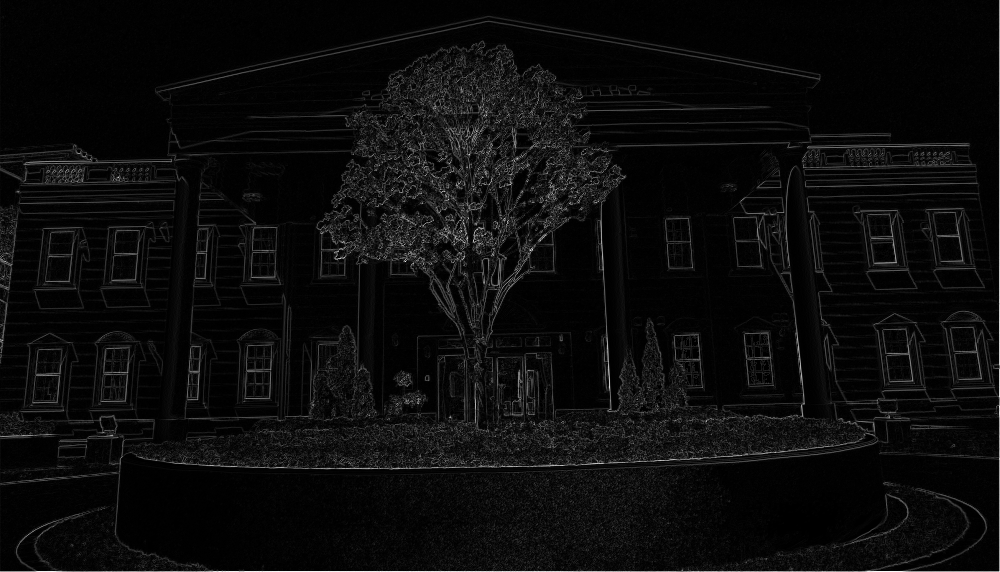

## エッジ検出

[English](README.en.md) | [日本語](README.md)

---------------------------------------

既存の関数を使わずプログラミングしたエッジ検出

`.py` and `.ipynb` version

### ライブラリー
- Numpy
- OpenCV
- Time

## 方法
- Difference
- Prewitt
- Roberts
- Sobel
- Laplacian 4
- Laplacian 8

各フィルターの実行時間：約10秒

## テスト

入力画像

出力画像

  

    
    
    
  

  

    
     
    
  

